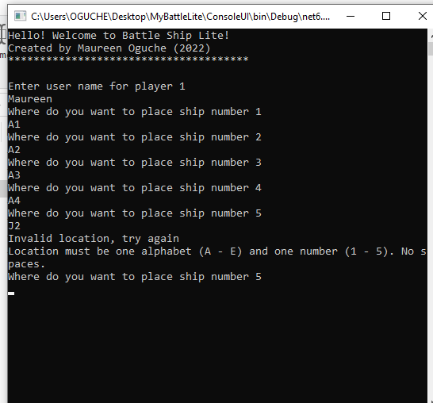

# BattleLiteConsoleGame

This is a lite console version of the Battleship game. It is a strategy type guessing game for two players, played on grids. 

### Screeenshot

## Table of Contents
- [Features](#Features)
- [Game Play](game-play)
- [My process](#my-process)
    - [Built with](#built-with)
    - [What I learned](#what-i-learned)
- [Author](#author)

## Features:

- 5 x 5 grid
- Each user has 5 ships

## Game Play

Game starts by welcoming user. Next, it requests for first player to enter user name, and place ships.
Reapeats process for second player.

First player's shot grid is then displayed and player is asked to place a shot. If player hits opponent shot, player is immediately told it's a hit else, player is told it's a miss.

Process is repeated alternating between the two players.

The first player to hit (sink) all opponent's shots is declared winner and game ends.

## Usage
- Open the folder titled "AppFolder"
- Run the ConsoleUI exe file (for windows)

- For other OS, Souce code is in the folder titled "Source Codes", complile and run.

## My Process
### Built with
- C# / dotNet

### What I learned
- C# Basics
- Basics of Object Oriented Programming (OOP)
- Access Modifiers in C#
- Software Desing Principles - Single Responsibility Principle (SRP)

## Author
- [Maureen Oguche](https://github.com/MaureenMOguche)
- Twitter - [@MaureenOguche](https://www.twitter.com/MaureenOguche)